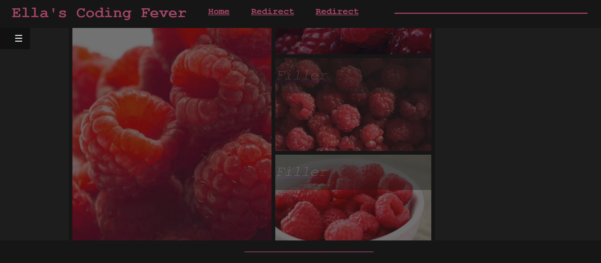
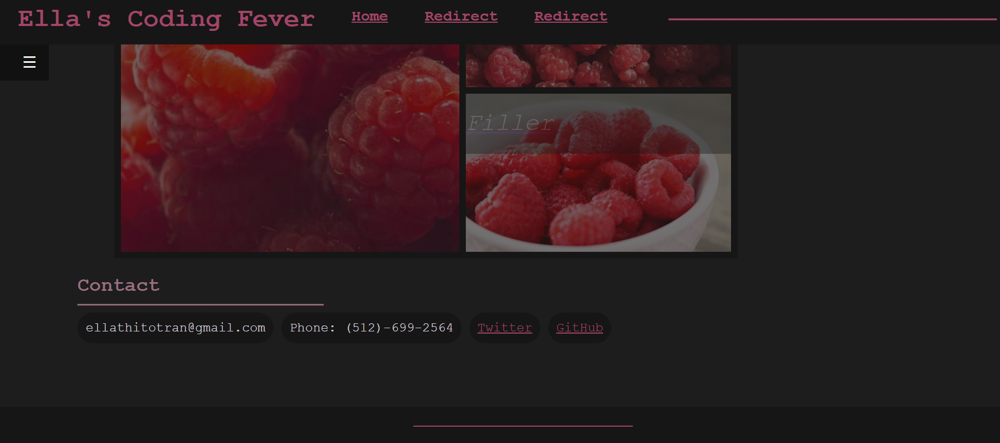

# Ellas-coding-fever
Webpage that features an about me section (filler), images of raspberries to represent the application and fillers(with clickable images), and a contact section. There is another raspberry image to represent the avatar, and the navbar links that redirect to unfinished/testing pages (as more filler). The hamburger style box under the left side of the nav bar is the link scroll redirection, where it will scroll to the corresponding sections of the page. 

When the window is shrunk, the avatar will disappear, the text paragraph will lengthen to accustom to the shortening width, the grid will get thinner, and the list items will stack ontop of eachother.

